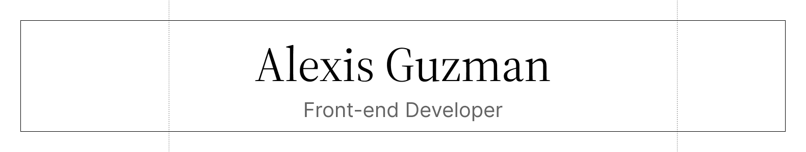

<p align='center'>Hey there! I’m <strong>Alexis Guzman</strong>, a passionate developer and entrepreneur based in Mexico. My journey began with a curiosity for technology and a drive to create impactful digital experiences.</p>

<div align='center'>
  <a href='https://www.codingcodax.dev' target='_blank'>
    
  </a>
  <a href='https://linkedin.com/in/codingcodax' target='_blank'>
    
  </a>
  <a href='mailto:hello@codingcodax.com' target='_blank'>
    
  </a>
  <a href='https://x.com/codingcodax' target='_blank'>
    
  </a>
  <a href='https://www.instagram.com/codingcodax' target='_blank'>
    
  </a>
  <a href='https://www.youtube.com/@codingcodax' target='_blank'>
    
  </a>
</div>


---

<h3 align='center'>A little more about me...</h3>

```typescript
#!/usr/bin/env node

class FrontEndDeveloper {
  constructor() {
    this.name = "Alexis Guzman";
    this.role = "Front-end Developer";
    this.languageSpoken = ["es_MX", "en_US"];
    this.pronouns = ["He", "Him"];
    this.code = ["HTML", "CSS", "Javascript", "Typescript"];
    this.tools = ["NextJS", "ReactJS", "Radix UI", "TailwindCSS", "Drizzle", "tRPC"];
    this.askMeAbout = ["web dev", "tech", "app dev", "otaku stuff"];
  }

  sayHi() {
    console.log("It was great to see you! I hope you enjoy exploring my work.");
  }
}

const codingcodax = new FrontEndDeveloper();

codingcodax.sayHi();
```

---

<!--START_SECTION:waka-->


**I'm an Early 🐤** 

```text
🌞 Morning                13449 commits       ██████░░░░░░░░░░░░░░░░░░░   22.31 % 
🌆 Daytime                33342 commits       ██████████████░░░░░░░░░░░   55.32 % 
🌃 Evening                13337 commits       ██████░░░░░░░░░░░░░░░░░░░   22.13 % 
🌙 Night                  147 commits         ░░░░░░░░░░░░░░░░░░░░░░░░░   00.24 % 
```
📅 **I'm Most Productive on Thursday** 

```text
Monday                   10203 commits       ████░░░░░░░░░░░░░░░░░░░░░   16.93 % 
Tuesday                  8565 commits        ████░░░░░░░░░░░░░░░░░░░░░   14.21 % 
Wednesday                9073 commits        ████░░░░░░░░░░░░░░░░░░░░░   15.05 % 
Thursday                 10891 commits       █████░░░░░░░░░░░░░░░░░░░░   18.07 % 
Friday                   10542 commits       ████░░░░░░░░░░░░░░░░░░░░░   17.49 % 
Saturday                 6274 commits        ███░░░░░░░░░░░░░░░░░░░░░░   10.41 % 
Sunday                   4727 commits        ██░░░░░░░░░░░░░░░░░░░░░░░   07.84 % 
```


📊 **This Week I Spent My Time On** 

```text
🕑︎ Time Zone: America/Mexico_City

💬 Programming Languages: 
TypeScript               23 hrs 42 mins      ███████████████████████░░   90.58 % 
markdown.mdx             1 hr 6 mins         █░░░░░░░░░░░░░░░░░░░░░░░░   04.20 % 
Makefile                 47 mins             █░░░░░░░░░░░░░░░░░░░░░░░░   03.04 % 
Bash                     18 mins             ░░░░░░░░░░░░░░░░░░░░░░░░░   01.15 % 
TOML                     13 mins             ░░░░░░░░░░░░░░░░░░░░░░░░░   00.83 % 

🔥 Editors: 
Neovim                   26 hrs 10 mins      █████████████████████████   100.00 % 

💻 Operating System: 
Mac                      18 hrs 52 mins      ██████████████████░░░░░░░   72.10 % 
Linux                    7 hrs 18 mins       ███████░░░░░░░░░░░░░░░░░░   27.90 % 
```

**I Mostly Code in TypeScript** 

```text
TypeScript               44 repos            ██████████████░░░░░░░░░░░   55.70 % 
Astro                    3 repos             █░░░░░░░░░░░░░░░░░░░░░░░░   03.80 % 
Lua                      2 repos             █░░░░░░░░░░░░░░░░░░░░░░░░   02.53 % 
MDX                      1 repo              ░░░░░░░░░░░░░░░░░░░░░░░░░   01.27 % 
Shell                    1 repo              ░░░░░░░░░░░░░░░░░░░░░░░░░   01.27 % 
```


<!--END_SECTION:waka-->
