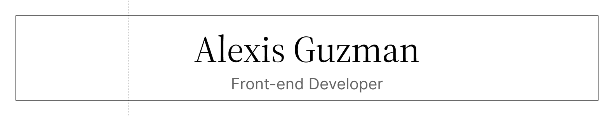

<p align='center'>Hey there! I’m <strong>Alexis Guzman</strong>, a passionate developer and entrepreneur based in Mexico. My journey began with a curiosity for technology and a drive to create impactful digital experiences.</p>

<div align='center'>
  <a href='https://www.codingcodax.dev' target='_blank'>
    
  </a>
  <a href='https://linkedin.com/in/codingcodax' target='_blank'>
    
  </a>
  <a href='mailto:hello@codingcodax.com' target='_blank'>
    
  </a>
  <a href='https://x.com/codingcodax' target='_blank'>
    
  </a>
  <a href='https://www.instagram.com/codingcodax' target='_blank'>
    
  </a>
  <a href='https://www.youtube.com/@codingcodax' target='_blank'>
    
  </a>
</div>


---

<h3 align='center'>A little more about me...</h3>

```typescript
#!/usr/bin/env node

class FrontEndDeveloper {
  constructor() {
    this.name = "Alexis Guzman";
    this.role = "Front-end Developer";
    this.languageSpoken = ["es_MX", "en_US"];
    this.pronouns = ["He", "Him"];
    this.code = ["HTML", "CSS", "Javascript", "Typescript"];
    this.tools = ["NextJS", "ReactJS", "Radix UI", "TailwindCSS", "Drizzle", "tRPC"];
    this.askMeAbout = ["web dev", "tech", "app dev", "otaku stuff"];
  }

  sayHi() {
    console.log("It was great to see you! I hope you enjoy exploring my work.");
  }
}

const codingcodax = new FrontEndDeveloper();

codingcodax.sayHi();
```

---

<!--START_SECTION:waka-->


**I'm an Early 🐤** 

```text
🌞 Morning                5452 commits        ██████░░░░░░░░░░░░░░░░░░░   25.55 % 
🌆 Daytime                10842 commits       █████████████░░░░░░░░░░░░   50.80 % 
🌃 Evening                4891 commits        ██████░░░░░░░░░░░░░░░░░░░   22.92 % 
🌙 Night                  156 commits         ░░░░░░░░░░░░░░░░░░░░░░░░░   00.73 % 
```
📅 **I'm Most Productive on Friday** 

```text
Monday                   2783 commits        ███░░░░░░░░░░░░░░░░░░░░░░   13.04 % 
Tuesday                  3841 commits        ████░░░░░░░░░░░░░░░░░░░░░   18.00 % 
Wednesday                3107 commits        ████░░░░░░░░░░░░░░░░░░░░░   14.56 % 
Thursday                 3254 commits        ████░░░░░░░░░░░░░░░░░░░░░   15.25 % 
Friday                   4086 commits        █████░░░░░░░░░░░░░░░░░░░░   19.15 % 
Saturday                 2995 commits        ████░░░░░░░░░░░░░░░░░░░░░   14.03 % 
Sunday                   1275 commits        █░░░░░░░░░░░░░░░░░░░░░░░░   05.97 % 
```


📊 **This Week I Spent My Time On** 

```text
🕑︎ Time Zone: America/Mexico_City

💬 Programming Languages: 
TypeScript               9 hrs 43 mins       ██████████████░░░░░░░░░░░   55.12 % 
Markdown                 3 hrs 54 mins       ██████░░░░░░░░░░░░░░░░░░░   22.20 % 
JSON                     1 hr 29 mins        ██░░░░░░░░░░░░░░░░░░░░░░░   08.42 % 
TOML                     1 hr 17 mins        ██░░░░░░░░░░░░░░░░░░░░░░░   07.35 % 
Bash                     37 mins             █░░░░░░░░░░░░░░░░░░░░░░░░   03.59 % 

🔥 Editors: 
Neovim                   17 hrs 37 mins      █████████████████████████   100.00 % 

💻 Operating System: 
Linux                    10 hrs 23 mins      ███████████████░░░░░░░░░░   58.92 % 
Mac                      7 hrs 14 mins       ██████████░░░░░░░░░░░░░░░   41.08 % 
```

**I Mostly Code in TypeScript** 

```text
TypeScript               44 repos            ██████████████░░░░░░░░░░░   55.70 % 
Lua                      3 repos             █░░░░░░░░░░░░░░░░░░░░░░░░   03.80 % 
Astro                    3 repos             █░░░░░░░░░░░░░░░░░░░░░░░░   03.80 % 
MDX                      1 repo              ░░░░░░░░░░░░░░░░░░░░░░░░░   01.27 % 
Python                   1 repo              ░░░░░░░░░░░░░░░░░░░░░░░░░   01.27 % 
```


<!--END_SECTION:waka-->
